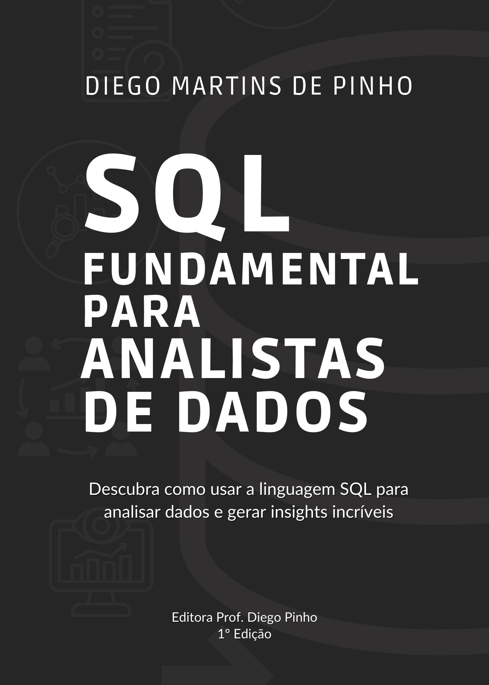

SQL fundamental para analista de dados
======================
Repositório oficial do livro: SQL fundamental para analista de dados

Sobre o livro
------
O livro SQL fundamental para analista de dados é um guia prático para você que deseja aprender SQL do zero ou aprimorar seus conhecimentos na linguagem. Com uma abordagem simples e direta, o livro apresenta os conceitos fundamentais do SQL, desde a criação de tabelas até consultas complexas, utilizando exemplos reais do dia a dia de um analista de dados. Você aprenderá a manipular dados, realizar análises e gerar relatórios eficientes, tudo isso com uma linguagem acessível e didática.

Como estudar
------
Este repositório está dividido da mesma maneira que o livro. Cada diretório corresponde a um capítulo do livro e possui pelo menos dois arquivos:
* exercicios.md
* gabarito.md

Após ler o capítulo no livro, acesse os exercícios do capítulo correspondente e tente resolvê-los. Você pode desenvolvê-los na sua máquina local ou utilizar algum interpretador PostgreSQL online. Recomendo o [OneCompiler](https://onecompiler.com/postgresql). Se conseguir resolver, continue treinando! Caso trave ou tenha algum problema, você pode consultar o gabarito. Lá você encontrará a solução recomendada para o problema.

Bons estudos!

Obrigado!

Dados do livro
------
**Número de páginas:** 256

**ISBN:** 978-85-5519-258-6

------
Tendo algum dúvida, crítica, sugestão ou até mesmo encontrar um erro, não hesite em entrar em contato! Também fique a vontade para fazer um fork neste projeto e fazer sugestões de exercícios.

**SQL fundamental para analista de dados** © 2025+, Diego Martins de Pinho. Publicado pela editora [Prof. Diego Pinho](https://www.diegopinho.com.br/). Todos os direitos reservados.

> Site oficial [diegopinho.com.br](https://diegopinho.com.br/) &nbsp;&middot;&nbsp;
> Instagram [@diegopinho](https://www.instagram.com/profdiegopinho/) &nbsp;&middot;&nbsp;
> LinkedIn [@profdiegopinho](https://www.linkedin.com/company/profdiegopinho/) &nbsp;&middot;&nbsp;
> Youtube [@profdiegopinho](https://www.youtube.com/@ProfDiegoPinho) &nbsp;&middot;&nbsp;